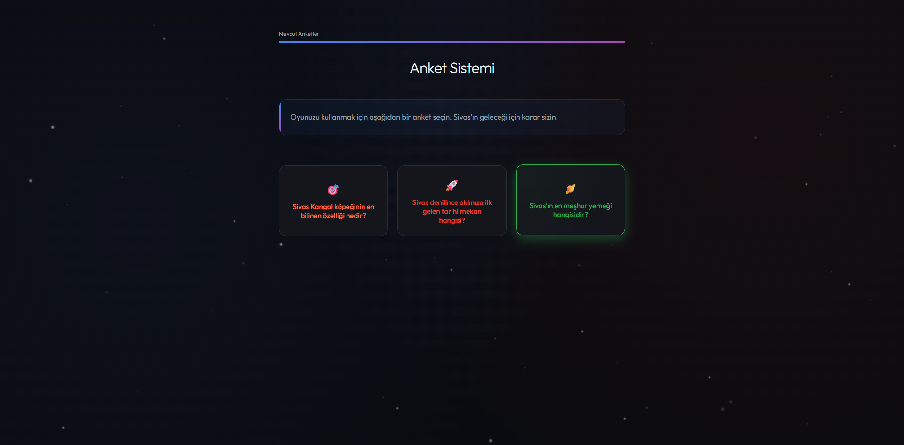

# Django Anket Sistemi (Sivas Temalı & Neon UI)

Bu proje, standart bir Django Polls uygulamasının modern, karanlık ve neon bir tasarımla (`Galaxy UI`) yeniden hayal edilmiş versiyonudur. İçerik tamamen Sivas kültürüne yönelik olarak özelleştirilmiştir.

## Özellikler

- **Modern Tasarım:** Galaksi/Neon temalı glassmorphic kartlar ve parlayan butonlar.
- **Sivas İçeriği:** Sivas köftesi, Divriği Ulu Camii ve Kangal köpeği gibi yerel değerleri içeren anketler.
- **Responsive Arayüz:** Telefon, tablet ve masaüstü cihazlar için tam uyumlu grid yapısı.
- **Animasyonlu Arkaplan:** Uzay atmosferi için hareketli partikül efektleri.
- **Progress Bar:** Oylama sonuçları için şık görsel barlar.

## Ekran Görüntüsü

## Teknolojiler

- **Python & Django:** Backend mantığı ve veritabanı yönetimi.
- **HTML5 & CSS3:** Modern grid layout, flexbox ve özel animasyonlar.
- **JavaScript:** Dinamik partikül üretimi.

---
*Geliştirici: MrAltay*
