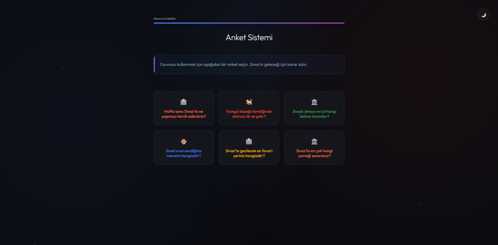
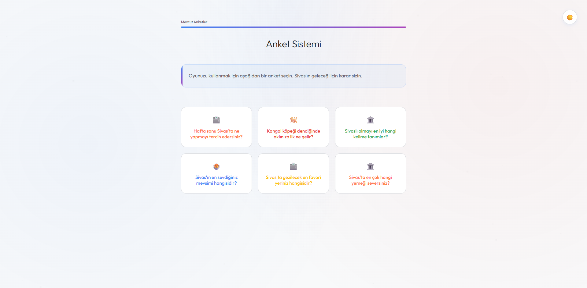

# Django Anket Sistemi (Sivas Temalı & Neon UI)

Bu proje, standart bir Django Polls uygulamasının modern, karanlık ve neon bir tasarımla (`Galaxy UI`) yeniden hayal edilmiş versiyonudur. İçerik tamamen Sivas kültürüne yönelik olarak özelleştirilmiştir.

## Özellikler

- **Modern Tasarım:** Sivas temalı anket kartları ve interaktif UI öğeleri.
- **Gece/Gündüz Modu:** Kullanıcı tercihine göre değişen ve tercihi hatırlayan tema desteği.
- **Sivas İçeriği:** Sivas'ın yemekleri, tarihi mekanları ve kültürü üzerine fikir anketleri.
- **Responsive Arayüz:** Telefon, tablet ve masaüstü cihazlar için tam uyumlu yapı.
- **Animasyonlu Arkaplan:** Temaya göre renk değiştiren hareketli partikül efektleri.
- **Progress Bar:** Oylama sonuçları için şık görsel barlar.

### Karanlık Mod (Varsayılan)

### Aydınlık Mod

## Teknolojiler

- **Python & Django:** Backend mantığı ve veritabanı yönetimi.
- **HTML5 & CSS3:** Modern grid layout, flexbox ve özel animasyonlar.
- **JavaScript:** Dinamik partikül üretimi.

---
*Geliştirici: MrAltay*
